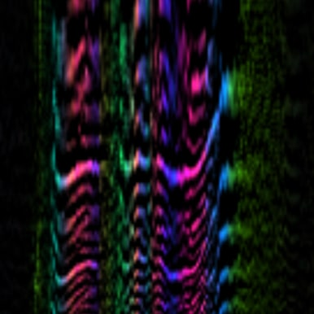

# CARFAC

The CAR-FAC (cascade of asymmetric resonators with fast-acting compression) is a
cochlear model implemented as an efficient sound processor, for mono, stereo, or
multi-channel sound inputs.

This package includes Matlab and C++ implementations of the CARFAC model as well
as code for computing Stabilized Auditory Image (SAI) and pitchogram
representations.

**Web demo (click to open)**

See the [design doc](CARFAC_Design_Doc.txt) for a more detailed discussion of
the software design.

## Links

-   Project homepage: https://github.com/google/carfac
-   Mailing list: carfac-dev@googlegroups.com or on the web at
    http://groups.google.com/group/carfac-dev

## Requirements

The Matlab implementation does not depend on any toolboxes.

The C++ implementation is built using the [Eigen linear algebra
library](http://eigen.tuxfamily.org). Tests also depend on the [Google C++
Testing Framework](http://code.google.com/p/googletest/)].

See cpp/SConstruct for instructions for building the C++ library and running
tests using the [SCons build tool](http://www.scons.org/).
